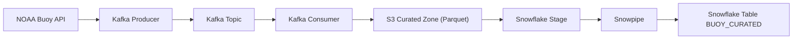
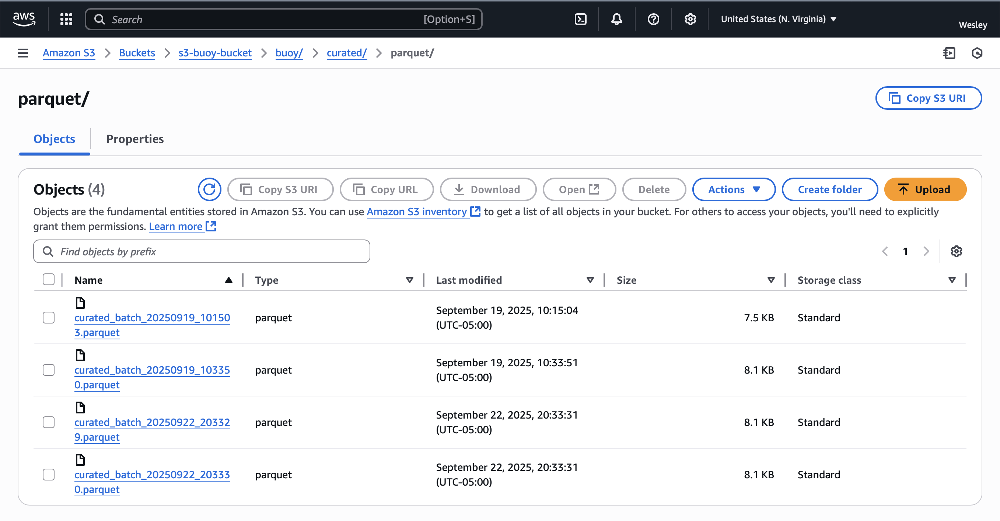

# Real-Time NOAA Buoy Data Pipeline


A **real-time data pipeline** that ingests live buoy sensor data from NOAA, streams it through **Kafka (Redpanda)**, curates and transforms the data, lands it in **Amazon S3**, and automatically loads it into **Snowflake** via **Snowpipe** for analytics.  

The goal is to demonstrate end-to-end **streaming data engineering skills**: real-time ingestion, message queuing, schema enforcement, cloud landing zones, and automated warehouse loading.

---

## 📐 Architecture


---

## ✅ Features

- **Streaming ingestion** from NOAA buoy station `51004` (configurable)
- **Kafka (Redpanda)** for message streaming
- **Data curation**: timestamp normalization, missing value handling, Beaufort wind scale classification
- **Schema enforcement** with Parquet for strong typing
- **Cloud landing zone**: Amazon S3 bucket stores curated Parquet files
- **Automated loading** into Snowflake via Snowpipe
- **Analytics-ready table**: `BUOY_CURATED` with clean schema

---

## ⚡ Tech Stack
- **Kafka / Redpanda** – streaming backbone  
- **Python** – producer + consumer  
- **boto3** – S3 integration  
- **Snowflake + Snowpipe** – warehouse + auto-ingestion  
- **Pandas** – schema enforcement, Parquet output  
- **Docker Compose** – local infrastructure for Kafka  

---

## 📦 Prerequisites

- **Docker Desktop** (or Docker Engine + Compose) installed and running  
- **Python 3.11+** installed locally  
- A valid **Snowflake account** (for warehouse integration)  
- An **AWS account** with:
  - S3 bucket (landing zone for curated data)  
  - IAM role configured for Snowpipe auto-ingestion 

---

## 📂 Project Structure
```
.
├── src/
│   ├── producer/
│   │   └── producer_buoy.py
│   ├── consumer/
│   │   └── consumer_buoy.py
├── docker-compose.yml
├── requirements.txt
├── .env.example
└── README.md
```

---

## 🛠 Setup

### 1. Clone repo
```bash
git clone https://github.com/yourusername/streaming-pipeline.git
cd streaming-pipeline
cp .env.example .env
```

### 2. Install dependencies
```bash
# (Optional but recommended) create a virtual environment
python -m venv venv
source venv/bin/activate   # On macOS/Linux
venv\Scripts\activate      # On Windows

# Install dependencies
pip install -r requirements.txt
```

### 3. Environment variables
Fill `.env` with your values:

```bash
BOOTSTRAP_SERVERS=localhost:9092
KAFKA_TOPIC=buoy_station_51004
STATION_ID=51004

AWS_REGION=us-east-1
S3_BUCKET=your-bucket-name
S3_PREFIX=buoy/curated/parquet
AWS_ACCESS_KEY_ID=xxx
AWS_SECRET_ACCESS_KEY=xxx

# Records per file written to S3
# 1 = fast demo mode (default in .env.example)
# 10 = production-like batching
BATCH_SIZE=1
```

### 4. Start Kafka/Redpanda
```bash
docker compose up -d
```

### 5. Run producer
Run the producer in a **separate terminal**:  
```bash
python src/producer/producer_buoy.py
```

### 6. Run consumer
Run the consumer in a **separate terminal**: 
```bash
python src/consumer/consumer_buoy.py
```

---
## ⚖️ Batching vs. Real-Time Flush

By default, the consumer writes **one record per file** to S3.  
This makes the pipeline more **demo-friendly**: when you run it locally, you can immediately see data land in S3 and flow into Snowflake without waiting for a large batch.

In production, though, writing one row per file is inefficient — it creates too many small “micro files” in S3 and slows down downstream queries.  
A more realistic approach is to **batch records together** (e.g., 10–100 per file) before writing.

You can configure this behavior in the `.env` file:

```env
# Write one record per file (fast demo mode)
BATCH_SIZE=1

# Write 10 records per file (more production-like)
BATCH_SIZE=10
```
👉 **Recommendation:** Keep `BATCH_SIZE=1` for trying out the project, and switch to `BATCH_SIZE=10` (or larger) to simulate more realistic data engineering practice.

---

You can configure this behavior in the `.env` file:

## 📊 Pipeline Output

Below is a snapshot of Parquet files ingested into S3 by the pipeline:  



*Example of NOAA buoy data successfully ingested into Amazon S3.*  

---

## ❄️ Snowflake Setup

```sql
-- 1. Create stage & integration
CREATE STORAGE INTEGRATION buoy_integration
  TYPE = EXTERNAL_STAGE
  STORAGE_PROVIDER = S3
  ENABLED = TRUE
  STORAGE_AWS_ROLE_ARN = '<your-aws-role-arn>'
  STORAGE_ALLOWED_LOCATIONS = ('s3://your-bucket-name/buoy/curated/parquet/');

-- 2. Create external stage
CREATE OR REPLACE STAGE buoy_stage
  STORAGE_INTEGRATION = buoy_integration
  URL = 's3://your-bucket-name/buoy/curated/parquet/';

-- 3. Create target table
CREATE OR REPLACE TABLE BUOY_CURATED (
    timestamp TIMESTAMP_NTZ,
    wind_dir_deg FLOAT,
    wind_speed_mps FLOAT,
    wind_gust_mps FLOAT,
    wave_height_m FLOAT,
    wave_period_s FLOAT,
    wave_dir_deg FLOAT,
    pressure_hpa FLOAT,
    air_temp_c FLOAT,
    water_temp_c FLOAT,
    dewpoint_temp_c FLOAT,
    visibility_nmi FLOAT,
    tide_m FLOAT,
    wind_category STRING
);

-- 4. Create Snowpipe
CREATE OR REPLACE PIPE buoy_pipe
  AUTO_INGEST = TRUE
  AS
  COPY INTO BUOY_CURATED
  FROM @buoy_stage
  FILE_FORMAT = (TYPE = PARQUET)
  MATCH_BY_COLUMN_NAME = CASE_INSENSITIVE
  ON_ERROR = CONTINUE;
```

---

## 🔎 Example Query

```sql
SELECT 
    DATE_TRUNC('hour', timestamp) AS hour,
    AVG(wind_speed_mps) AS avg_wind_speed,
    AVG(wave_height_m) AS avg_wave_height
FROM BUOY_CURATED
GROUP BY hour
ORDER BY hour DESC
LIMIT 10;
```

---

## 📌 Notes
- NOAA “MM” values are treated as missing measurements
- Timestamps parsed natively into TIMESTAMP_NTZ in Snowflake  
- Easily configurable for more buoy stations via `.env`
- `BATCH_SIZE` trade-off:
  - `1` = fast demo mode (many small files, immediate results)  
  - `10` = production-like (fewer, larger files, more efficient for storage) 

---

## 🧹 Tear Down (Cleanup)
```bash
docker compose down	
docker compose down --volumes --remove-orphans
```

---

📫 Connect with me: [LinkedIn](https://www.linkedin.com/in/wes-martin/) | [Portfolio](https://github.com/WesJM/data-engineering-portfolio)
